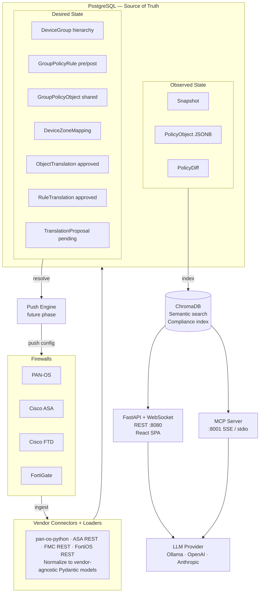
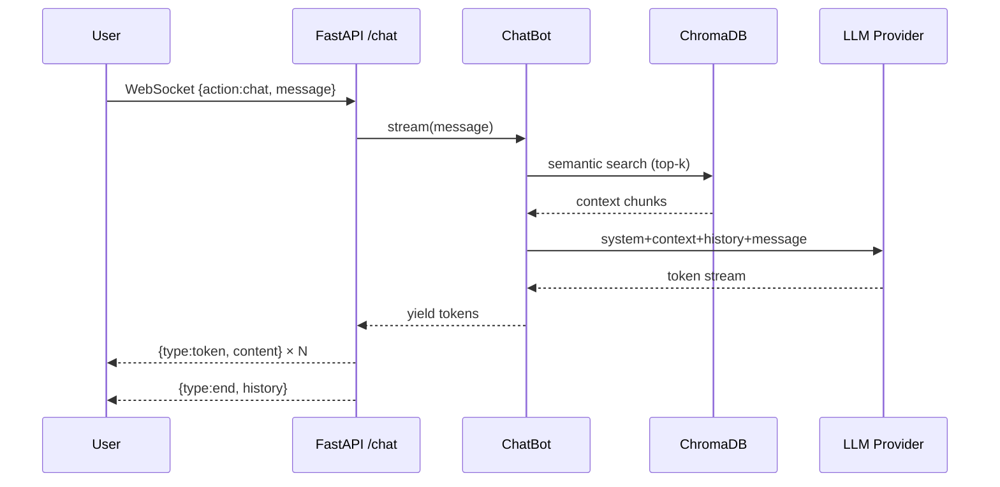
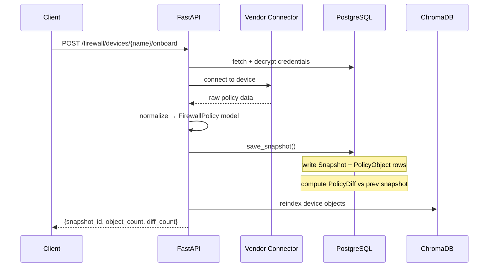
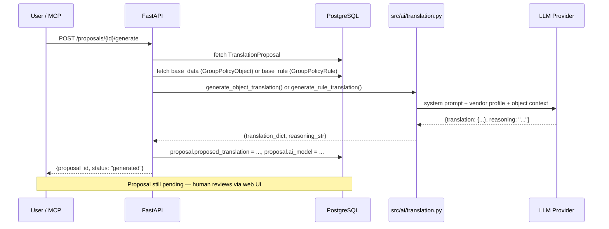
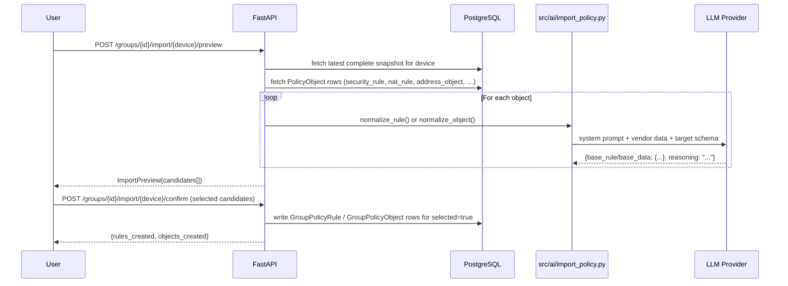
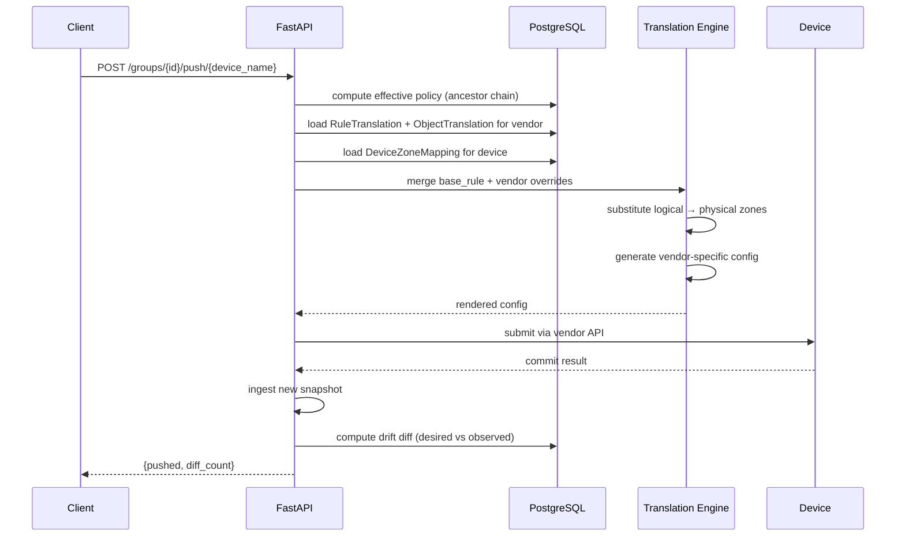

# Architecture

## Overview

This platform manages firewall policy across multiple vendors from a single source of truth. It has two distinct operational modes that coexist:

- **Observe** — ingest the current state of devices into Postgres and index it for AI-assisted analysis and chat
- **Manage** — define desired-state policy in a vendor-neutral group hierarchy and push it to devices (push engine is a future phase)

---

## Components



---

## Data model — two categories

### Observed state (ingest pipeline)

Written on every device sync. Never edited directly by users.

| Table | Purpose |
|---|---|
| `devices` | Registered device inventory with encrypted credentials |
| `snapshots` | One row per ingest run; tracks status and object count |
| `policy_objects` | Every policy object from a snapshot stored as JSONB |
| `policy_diffs` | Change records auto-computed between consecutive snapshots |

### Desired state (policy management)

Managed by users via the UI or API. These tables form the SOT for what should be on devices.

| Table | Purpose |
|---|---|
| `device_groups` | Hierarchical group tree (parent_id self-reference) — rendered as "Groups" in the UI |
| `group_policy_rules` | Rules defined at group level (pre/post rulebases, vendor-agnostic) |
| `group_policy_objects` | Shared objects at group or root scope |
| `device_zone_mappings` | Maps logical zone names → device-specific zone names |
| `object_translations` | Approved vendor-specific representation of a named object |
| `rule_translations` | Approved vendor-specific override for a group rule |
| `translation_proposals` | AI-generated translation proposals pending human review |

---

## Request flow — chat query



## Request flow — device ingest



## Request flow — AI translation generation



## Request flow — import policy from device



## Request flow — push (future)



---

## LLM configuration

Two providers are configured independently — one for reasoning, one for embeddings:

```bash
LLM_PROVIDER=ollama        # ollama | openai | anthropic
LLM_MODEL=llama3.2
EMBED_PROVIDER=ollama      # ollama | openai
EMBED_MODEL=nomic-embed-text
```

This lets you run, for example, `anthropic` + `claude-sonnet-4-6` for chat while keeping `ollama` + `nomic-embed-text` for embeddings (fast, local, no API cost).

---

## Frontend

The React SPA is built with Vite + React + Tailwind CSS v4. It is served directly from FastAPI's static file handler in production (built output lands in `src/api/static/`). In development, run `npm run dev` from `frontend/` — the Vite dev server proxies `/api` and `/ws` to `localhost:8080`.

Build requires Node 22+ (`nvm use 22`).

See [docs/policy-management.md](policy-management.md) for the group hierarchy design.  
See [docs/vendor-support.md](vendor-support.md) for per-vendor object coverage.
