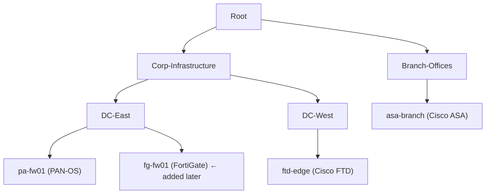
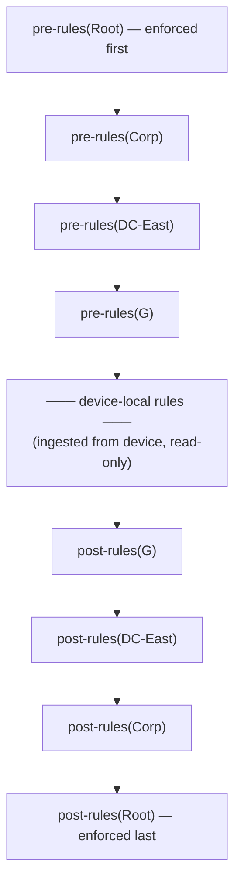
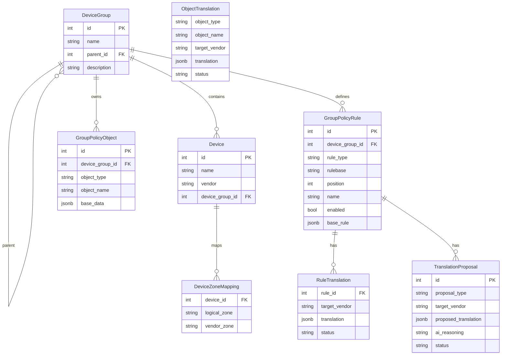

# Policy Management — Group Hierarchy and Vendor Translation

## Concept

The policy management layer is modelled after Panorama's device group hierarchy, generalized to support multiple vendors in the same group. The core idea: define policy once, in vendor-neutral terms, at the group level — then let the platform translate and push it to each device in the group regardless of vendor.

This document covers:
1. Group hierarchy
2. Rulebases and inheritance
3. Shared objects
4. Zone mappings
5. Vendor translation model (deterministic vs AI-assisted)
6. Translation proposal workflow
7. Import policy from device (observed → desired state)
8. Push readiness and gap detection

---

## 1. Group hierarchy



- Groups form a tree. A group can have any number of children.
- Devices are assigned to a group (leaf or otherwise).
- A device can be in exactly one group (or unassigned — still ingested and queryable, but not subject to group policy).
- Groups are created and managed via `POST /api/v1/groups`.

> **Terminology:** Ignis uses "group" throughout. The underlying database table is named `device_groups` for historical reasons — the two terms are equivalent.

---

## 2. Rulebases and inheritance

Each group has three rulebases: **pre**, **post**, and **local**.

For a device in group G whose ancestor chain is [Root → Corp → DC-East → G]:



**Pre-rules** are security policy that must apply everywhere — e.g. block known-bad IPs, allow management access from jump hosts.

**Post-rules** are safety nets — e.g. default deny-all with logging.

**Local rules** are device-specific rules outside the group-managed scope (e.g. a rule specific to one device's topology that doesn't apply to its siblings).

The `GET /api/v1/groups/{id}/effective-policy` endpoint returns the computed pre + post rulebase for any group.

---

## 3. Shared objects

Objects (address objects, service objects, application objects, etc.) can be defined at any level:

| Scope | device_group_id | Availability |
|---|---|---|
| Shared root | `NULL` | All groups and devices |
| Group-level | `<group_id>` | That group and all descendants |
| Device-local | N/A (observed state only) | Ingested from device, read-only |

Object names are resolved nearest-first: a device-level object with the same name as a group-level object takes precedence (same as Panorama's override behaviour).

Shared objects are managed via `GroupPolicyObject` records. They are **vendor-agnostic** — the vendor-specific rendering is stored in `ObjectTranslation`.

---

## 4. Zone mappings

Zones in group policy rules use **logical names** (e.g. `internal`, `external`, `dmz`). Each device maps its physical zone names to these logical names via `DeviceZoneMapping`.

```
Group policy rule:
  src_zones: ["internal"]
  dst_zones: ["external"]

DeviceZoneMapping for pa-fw01 (PAN-OS):
  internal → "trust"
  external → "untrust"

DeviceZoneMapping for fg-fw01 (FortiGate):
  internal → "LAN"
  external → "WAN"
```

Zone mappings are set during device onboarding via `PUT /api/v1/groups/devices/{name}/zones`. The push engine substitutes logical zones for vendor zones before generating device config.

---

## 5. Vendor translation model

When pushing a group policy rule to a device, the platform needs to render it in vendor-specific terms. The translation strategy has two tiers:

### Tier 1 — Deterministic (no AI)

Fields that map 1:1 across all vendors are translated by code:

| Field | Handling |
|---|---|
| `action` (allow/deny) | Deterministic — all vendors support allow/deny |
| `src_zones` / `dst_zones` | Substituted via DeviceZoneMapping |
| `src_addresses` / `dst_addresses` | Address object name lookup |
| `services` | Service object name lookup |
| `enabled` / `position` | Deterministic |
| `nat_type`, `translated_src/dst` | Deterministic for each vendor |

### Tier 2 — AI-assisted (vendor gap)

Fields where vendors have no direct equivalent require a translation decision:

| Field | Gap |
|---|---|
| `applications` (App-ID) | PAN-OS App-ID has no ASA equivalent → needs port mapping |
| `applications` cross-vendor | PAN-OS `ssl` ≠ FortiGate `SSL` signature name |
| `url_categories` | PAN-DB category names ≠ FortiGuard names ≠ Talos names |
| `profiles` (AV, IPS, etc.) | Profile type concepts align but names and structure differ |
| FQDN address objects | ASA has limited FQDN support |
| Geography objects | ASA has no geo-based objects |

For each gap, the AI generates a proposed translation. The human reviews and approves it. Once approved, it is stored in `ObjectTranslation` or `RuleTranslation` and used deterministically on all future pushes — **the AI is only consulted once per gap**.

### Resolution order at push time

For any object reference or rule field, the push engine resolves in this order:

```
1. RuleTranslation(rule_id, target_vendor)     → rule-specific override (highest priority)
2. ObjectTranslation(object_type, object_name, target_vendor)  → reusable object mapping
3. base_rule / base_data                        → vendor-neutral fallback
```

---

## 6. Translation proposal workflow

### Triggered automatically

When a new device is added to a device group, gap detection runs automatically for that device's vendor across the full effective policy (all ancestor groups).

```
POST /api/v1/groups/{id}/gaps/{vendor}
```

The endpoint:
1. Walks the full ancestor chain
2. Collects all `GroupPolicyRule` and `GroupPolicyObject` records
3. Checks each against `ObjectTranslation` and `RuleTranslation` for the target vendor
4. Creates `TranslationProposal` records (status=`pending`) for each gap
5. Returns a summary of what was found

### AI fills proposals

Proposals start with an empty `proposed_translation`. Use either the web UI or API to drive the AI:

**Single proposal:**
```
POST /api/v1/proposals/{id}/generate
```

**Batch — all empty pending proposals for a vendor:**
```
POST /api/v1/proposals/generate-batch?target_vendor=fortinet
```

For each proposal the AI receives:
- The vendor-neutral base definition (`base_data` or `base_rule`)
- Target vendor description (capabilities, object syntax, known gaps)
- Object-type-specific example translations to anchor the output format

The LLM returns `{translation: {...}, reasoning: "..."}`. The proposal remains `pending` — a human must still review and approve.

**From the MCP server:**
```
generate_ai_translations(target_vendor="fortinet")
```

### Human review

The UI surfaces all pending proposals for a vendor in a review queue. For each proposal:

| Action | Result |
|---|---|
| **Approve** | Creates/updates `ObjectTranslation` or `RuleTranslation` with `status=approved` |
| **Modify** | Human edits the proposed translation, then approves the modified version |
| **Reject** | Marks proposal `rejected`; the gap is noted but the push will use the vendor-neutral fallback |

Once all proposals for a vendor are reviewed, the device group shows `push-ready` status for that vendor.

### API endpoints

```
GET  /api/v1/proposals?status=pending&target_vendor=fortinet
POST /api/v1/proposals/{id}/review           body: {action, reviewed_by, modified_translation?}

GET  /api/v1/translations/objects?target_vendor=fortinet&status=approved
PUT  /api/v1/translations/objects            body: {object_type, object_name, target_vendor, translation}

GET  /api/v1/translations/rules?target_vendor=fortinet
PUT  /api/v1/translations/rules              body: {rule_id, target_vendor, translation}
```

---

## 7. Example: adding a FortiGate to an existing PAN-OS group

Scenario: Device Group `DC-East` already has `pa-fw01` (PAN-OS) with approved translations. You add `fg-fw01` (FortiGate).

**Step 1 — Assign device to group:**
```
POST /api/v1/groups/12/devices/fg-fw01
```

**Step 2 — Configure zone mappings:**
```
PUT /api/v1/groups/devices/fg-fw01/zones
[
  {"logical_zone": "internal", "vendor_zone": "LAN"},
  {"logical_zone": "external", "vendor_zone": "WAN"},
  {"logical_zone": "dmz",      "vendor_zone": "DMZ"}
]
```

**Step 3 — Run gap detection:**
```
POST /api/v1/groups/12/gaps/fortinet?triggered_by=device_onboard
```

Returns:
```json
{
  "missing_object_translations": [
    {"object_type": "application", "object_name": "ssl"},
    {"object_type": "application", "object_name": "web-browsing"},
    {"object_type": "url_category", "object_name": "gambling"}
  ],
  "missing_rule_translations": [
    {"rule_id": 5, "rule_name": "allow-saas-apps"}
  ],
  "proposals_created": 4
}
```

**Step 4 — AI generates proposals** (async):

For `ssl` → fortinet, the AI sees:
- Vendor-neutral: `{type: "application", name: "ssl", default_ports: ["tcp/443"]}`
- PAN-OS translation: `{type: "application", app_name: "ssl"}` (already approved)
- Proposes for FortiGate: `{type: "application_signature", app_name: "SSL", vendor_id: "40568"}`

**Step 5 — Human reviews proposals:**
```
GET /api/v1/proposals?status=pending&target_vendor=fortinet
POST /api/v1/proposals/7/review   {"action": "approve", "reviewed_by": "admin"}
POST /api/v1/proposals/8/review   {"action": "modify", "modified_translation": {...}, "reviewed_by": "admin"}
```

**Step 6 — fg-fw01 is now push-ready for group DC-East.**

---

## 7. Import policy from device (observed → desired state)

When a device has existing policy that you want to use as the group baseline, the import workflow converts it from vendor-specific observed state to vendor-agnostic desired state.

### Three paths from onboarded device to group policy

| Scenario | Path |
|---|---|
| **Clean slate** | Assign device to group, define policy at group level, push overwrites device |
| **Promote as-is** | Import device's latest snapshot → review AI-normalized output → confirm |
| **Massage and promote** | Import → selectively check/uncheck/edit candidates → confirm subset |

### Workflow

**Step 1 — Preview (AI normalization):**
```
POST /api/v1/groups/{group_id}/import/{device_name}/preview?limit=50
```

Reads the device's latest completed snapshot and runs each importable object through the AI:
- `security_rule`, `nat_rule` → normalized to `base_rule`
- `address_object`, `service_object`, `service_group`, `application`, `url_category`, `edl` → normalized to `base_data`

Returns a list of `ImportCandidate` records, each with:
- `vendor_data`: original vendor-specific content
- `proposed_base`: AI-generated vendor-agnostic form
- `reasoning`: AI explanation of normalization choices
- `selected`: pre-set to `true` if AI succeeded, `false` if it failed

**Step 2 — Review:**
The web UI shows a side-by-side table. Each row has a checkbox. You can:
- Deselect candidates you don't want
- The AI reasoning column explains what the normalization did
- Candidates with empty `proposed_base` (AI failed) are pre-deselected

**Step 3 — Confirm:**
```
POST /api/v1/groups/{group_id}/import/{device_name}/confirm
Body: {snapshot_id, candidates, rulebase: "pre"}
```

Only `selected=true` candidates are written:
- Rules → `GroupPolicyRule` rows with `description: "Imported from {device}"`
- Objects → `GroupPolicyObject` rows
- Duplicates (same name in the same group) are silently skipped

### Limitations

- The `limit` parameter caps how many objects are previewed in one call (default 50). For large configs, call in batches by offset filtering or increase the limit.
- Zone names in imported rules are preserved as-is (the device's zone names). Map them to logical zone names via the Zone Mappings tab after import.
- The AI normalization can fail or produce incorrect output for complex vendor-specific constructs. Always review before confirming.

---

## 8. MCP tools for group policy

These tools are available to Claude Desktop and other MCP clients:

| Tool | Description |
|---|---|
| `list_groups` | Show the full group hierarchy with device and rule counts |
| `get_group_effective_policy` | Show the computed pre+post rulebase for a group |
| `detect_translation_gaps` | Run gap detection for a vendor across a group's effective policy |
| `list_pending_proposals` | List proposals awaiting review |
| `generate_ai_translations` | Ask the AI to fill in empty pending proposals |

---

## Data model summary


